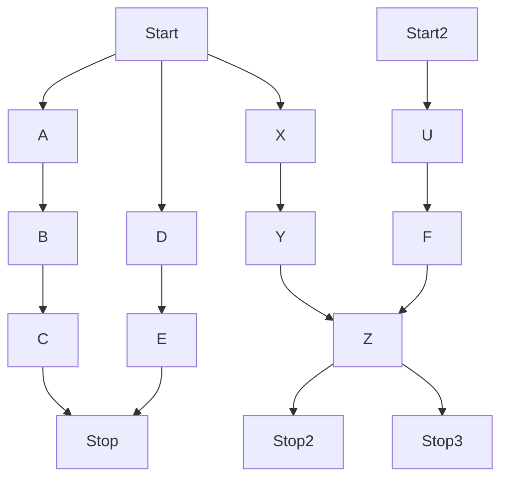

# first level title 👻

> 一级标题

## second level title with icon 🎮

> 二级标题

### third level title with animation ✅ 

> 三级标题

```js
// js code

```

```ts
// ts code

```

- a
- b
- c

1. 1
2. 2
3. 3

~~strikthrough line~~

**bold text**

*italic text*

> quote

[link](url)

$juejin inline code$ 👎 `github markdown inline code` 👍


```js
// code block

```

task list

- [x] task 1
- [ ] task 2
- [✅] task 3
- [❌] task 4


table

| Title | Description |
| -- | -- |
| Header 1| Text 1|
| Header 2| Text 2|
| Header 3| Text 3|

## 图片 

images 

```md

```


images 缩放 50%


```html

```

## 流程图




## refs

https://www.cnblogs.com/xgqfrms/p/16042291.html

https://cdn.xgqfrms.xyz/theme/index.html

https://codepen.io/xgqfrms/pen/JjMRqrQ

## 脚注

footnote,[^1]

footnote2,[^2]

自定义注解, [^custom_note]

自定义注解2, [^自定义注解2]

bignote, [^bignote]


[^1]: This is the first footnote.

[^2]: This is the second footnote.

[^custom_note]: 自定义注解

[^自定义注解2]: 自定义注解2

[^bignote]: Here's one with multiple paragraphs and code.
    
    缩紧 最前面 4 空格
    换行 最后面 2 空格
    代码 `js code`.
    finished！✅  
    

